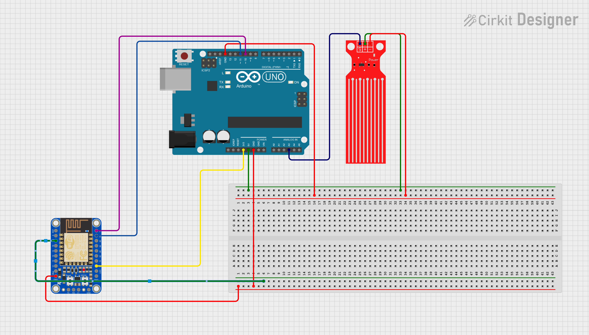

# SusmaBot

SusmaBot is a [Discord](https://discord.com) Bot made with [Python](https://www.python.org/downloads/release/python-3106/). 

This Discord bot connects with [Arduino Uno](https://www.arduino.cc) via [ThingSpeak](https://thingspeak.com) and It was made to monitor the water level of the user's pet with the information to be sent from the water sensor using ESP8266 WiFi module.

# Requirements
- Arduino Uno
- ESP8266 WiFi Module
- Water Level Sensor
- OLED LCD Display (Optional)
- Breadboard
- Male and Female Jumper Cables

# Circuit

# Warning 
For security reasons, tokens in .env file is missing. You need to add your Discord guild name and your bot's token.

## Usage
I'm currently using [Heroku](https://id.heroku.com/login) as the Discord bot's host, but I suggest you find a different host as it will be paid as of November 2022.

### Arduino
- Add your WiFi name and password to Arduino code to connect with ESP8266.

- Create a ThingSpeak account and create new channel.

- If you want to add new parameters such as tempature and so on you can add extra fields.

- Get Write a Channel Feed link and paste it to thingSpeakData variable at Arduino code.

### Python
- Add your Discord guild's name and bot's token to .env file.

- Add your channel link in request.get() as https://thingspeak.com/channels/your-channel-id/field/1. You can use Read a Channel Feed but since I only need single field I didn't used it.

- Every time you add new library to Python code you need to update requirements.txt. To do that from IDE terminal or CMD, type pip3 freeze > requirements.txt. This process needed for Cloud hosting of Discord bot.

You can find my other projects at my [GitHub page](https://github.com/ozaneski13).

Thank you for your contributions and your time.
